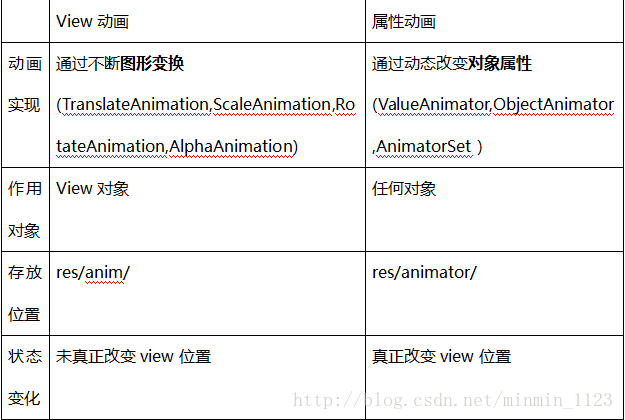

# Android 动画深入分析

Android中的动画分为三种View动画、帧动画和属性动画，其中帧动画也属于View动画的一种，只不过它和平移、旋转等常见的View动画在表现形式上略有不同而已。View动画通过对场景里的对象不断做图像变换(平移、缩放、旋转、透明度)从而产生动画效果，它是一种渐进式动画,并且View动画支持自定义。帧动画通过播放一系列图像从而产生动画效果，可以简单的理解为图片切换动画，很显然，如果图片过大会产生OOM，属性动画通过动态的改变对象的属性从而产生动画效果。

## View动画
View动画的作用对象是View,它支持四种动画效果，分别是平移动画、缩放动画、旋转动画、透明度动画。

### View动画的种类
View动画的四种变化效果对应的Animation的四个子类：TranslateAnimation、AlphaAnimation、RotateAnimation、ScaleAnimation。

|   名称       | xml标签        | 子类                |   效果
|  ----        |  ----      |----                 |   ----
| 平移动画      | translate  | TranslateAnimation  | 移动View 
| 缩放动画      | scale      |ScaleAnimation       | 放大或缩小View
| 旋转动画      | rotate     |RotateAnimation     | 旋转View
| 透明度动画    | alpha      |AlphaAnimation      | 改变View的透明度
使用View动画，要先创建动画的XML文件，文件的路径为:res/anim/filename.xml
``` xml
<?xml version="1.0" encoding="utf-8"?>
<set xmlns:android="http://schemas.android.com/apk/res/android"
    android:interpolator="@[package:]anim/interpolator_resource"
    android:shareInterpolator=["true" | "false"]
    android:fillAfter="true">
    <!--fillAfter: 动画结束后View是否停留在结束位置 -->
    
    <!-- 平移动画 对应TranslateAnimation-->
    <translate
        android:fromXDelta="float"
        android:toXDelta="float"
        android:fromYDelta="float"
        android:toYDelta="float"/>

    <!-- 
        缩放动画 对应ScaleAnimation
        pivotX:缩放的轴点的x坐标
        pivotY:缩放的轴点的y坐标
     -->
     <scale
        android:fromXScale="float"
        android:toXScale="float"
        android:fromYScale="float"
        android:toYScale="float"
        android:pivotX="float"
        android:pivotY="float"/>

    <!-- 
        旋转动画 对应于RotateAnimation 
        fromDegrees:旋转的开始角度
        toDegrees:旋转的结束角度
        pivotX:缩放的轴点的x坐标
        pivotY:缩放的轴点的y坐标
    -->
     <rotate
        android:fromDegrees="float"
        android:toDegrees="float"
        android:pivotY="float"
        android:pivotX="float"/>

    <!-- 透明度动画 对应于AlphaAnimation -->        
    <alpha 
        android:fromAlpha="float"
        android:toAlpha="float"/>

</set>

```
  &lt;set&gt;标签对应的是AnimationSet类,它可以包含多个动画并且它的内部也是可以嵌套其他动画集合的，它的两个属性的含义如下  

  android:interpolator  

表示动画集合所采用的插值器，差值器影响动画的速度，比如非匀速动画就需要通过插值器来控制动画的播放的过程。这个属性也可以不指定，默认参数为@android:anim/accelerate_decelerate_interpolator  

android:shareInterpolator  
表示集合中的动画是否和集合共享同一个插值器，如果集合不指定插值器，那么子动画就需要单独指定所需的插值器或者使用默认值。  
通过Animation的setAnimationListener方法可以设置动画的监听器。
``` java
    public static interface AnimationListener {
        /**
         * <p>Notifies the start of the animation.</p>
         *
         * @param animation The started animation.
         */
        void onAnimationStart(Animation animation);

        /**
         * <p>Notifies the end of the animation. This callback is not invoked
         * for animations with repeat count set to INFINITE.</p>
         *
         * @param animation The animation which reached its end.
         */
        void onAnimationEnd(Animation animation);

        /**
         * <p>Notifies the repetition of the animation.</p>
         *
         * @param animation The animation which was repeated.
         */
        void onAnimationRepeat(Animation animation);
    }
}

```

### 自定义View动画


### 帧动画
帧动画是顺序播放一组预先定义好的图片，类似于电影播放。不同于View动画，系统提供了另外一个类AnimationDrawable来使用帧动画。在res/drawable目录下新建xml文件。
``` xml
<?xml version="1.0" encoding="utf-8"?>
<animation-list xmlns:android="http://schemas.android.com/apk/res/android"
    android:oneshot="false">

    <item android:drawable="@drawable/image1" android:duration="500"/>
    <item android:drawable="@drawable/image2" android:duration="500"/>
    <item android:drawable="@drawable/image3" android:duration="500"/>

</animation-list>

```
然后将上述Drawable作为View的背景并通过Drawable来显示动画即可。
``` java
    view.setBackgroundResources(R.drawable/.frame_animation);
    AnimationDrawable drawable = view.getBackground();
    drawable.start();
```
> 在使用帧动画时避免使用尺寸较大的图片容易引起OOM。

## View动画的特殊使用场景

## 属性动画

### 使用属性动画
属性动画可以对任意对象的属性进行动画而不仅仅是View,动画的默认时间间隔为300ms，默认帧率为10ms/帧。属性动画可以完成在一个时间间隔内完成对象的一个属性值到另一个属性值的改变。属性动画和View动画的区别如下。


属性动画使用方法
```java
    public static ObjectAnimator ofFloat(Object target, String propertyName, float... values) {
        ObjectAnimator anim = new ObjectAnimator(target, propertyName);
        anim.setFloatValues(values);
        return anim;
    }
```
### 理解插值器和估值器
### 属性动画的监听器
### 属性动画的工作原理


## 使用动画的注意事项


