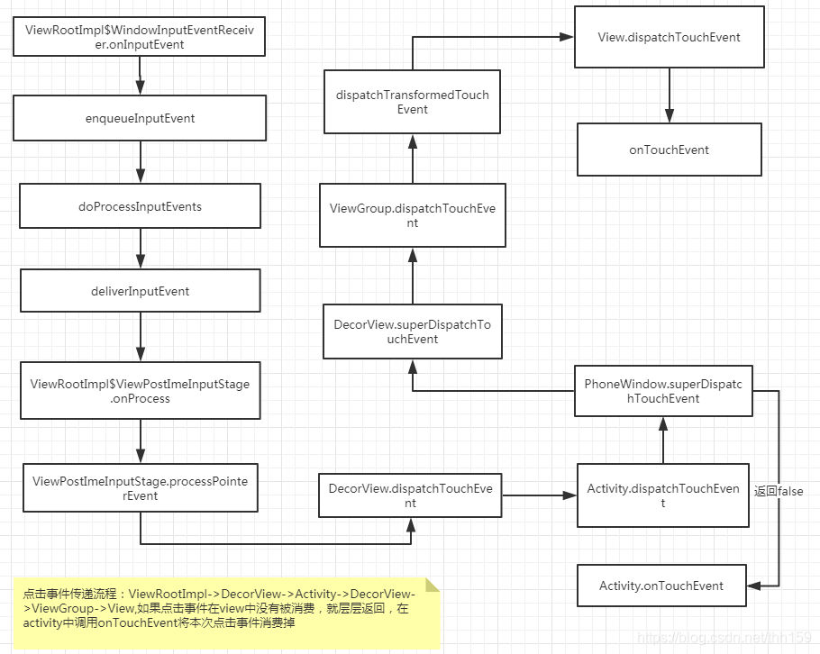

# **View的事件体系**


## 3.1 View基础知识

### 3.1.1 什么是View
### 3.1.2 View的位置参数
Android坐标系：以屏幕左上角为坐标原点，向右为x轴增大方向，向下为y轴增大方向。  
View的位置由四个顶点的位置决定，分别对应于View的四个属性：left、top、right、bottom。这些坐标是相对于View父容器而言的，是相对坐标。  

    
<br>  </br>

> 因此，View的宽高和坐标关系：width = right - left，height = bottom - top。

Android3.0后新添加了x、y和translationX、translationY，其中x和y是左上角的坐标，translationX和translationY是相对于View左上角的偏移量。    


<br>  </br>

> 存在关系：x = left + translationX，y = top + translationY  
> 由此可见，x和left不同体现在：left是View的初始坐标，在绘制完毕后就不会再改变；而x是View偏移后的实时坐标，是实际坐标。y和top的区别同理。

### 3.1.3 MotionEvent和TouchSlop
1. MotionEvent
 - Action_DOWN 手指刚接触屏幕
 - ACTION_MOVE 手机在屏幕上滑动
 - ACTION_UP 手指从屏幕上松开的一瞬间

通过MotionEvent对象可以得到点击事件的x和y坐标  
- getX()/getY() 相对于当前View左上角的坐标  
- getRawX()/getRawY() 相对于屏幕左上角的坐标

2. TouchSlop  
 TouchSlop 是系统所能识别出的被认为是滑动的最小距离，处理滑动时可以利用这个常量来做一些过滤。 
 /frameworks/base/core/res/res/values/config.xml  
 `
<dimen name="config_viewConfigurationTouchSlop">8dp</dimen>
`
<br></br>  

### 3.1.4 VelocityTracker、GestureDetector和Scroller

VelocityTracker： 用于跟踪手指在滑动过程中的速度，包括水平和垂直方向上的速度。  
GestureDetector：手势检测，用于辅助检测用户的单击、滑动、长按、双击等行为。  
Scroller：弹性滑动对象，实现View的弹性滑动。

## 3.2 View的滑动

### 3.2.1 使用scrollTo/scrollBy

``` java

    /**
     * Set the scrolled position of your view. This will cause a call to
     * {@link #onScrollChanged(int, int, int, int)} and the view will be
     * invalidated.
     * @param x the x position to scroll to
     * @param y the y position to scroll to
     */
    public void scrollTo(int x, int y) {
        if (mScrollX != x || mScrollY != y) {
            int oldX = mScrollX;
            int oldY = mScrollY;
            mScrollX = x;
            mScrollY = y;
            invalidateParentCaches();
            // 触发onScrollChanged回调
            onScrollChanged(mScrollX, mScrollY, oldX, oldY);
            if (!awakenScrollBars()) {
                postInvalidateOnAnimation();
            }
        }
    }
    // 相对于当前位置的滑动
    public void scrollBy(int x, int y) {
        scrollTo(mScrollX + x, mScrollY + y);
    }
```

**使用scrollTo()和scrollBy()实现View的滑动只能将View的内容进行移动，并不能将View本身移动。**  

使用scrollBy()方法进行滑动时是基于当前位置进行滑动的，mScrollX表示View内容左边缘和View左边缘的差值。
``` java
 /**
     * The offset, in pixels, by which the content of this view is scrolled
     * horizontally.
     * {@hide}
     */
    protected int mScrollX;
    /**
     * The offset, in pixels, by which the content of this view is scrolled
     * vertically.
     * {@hide}
     */
    protected int mScrollY;
```    

### 3.2.2 使用动画
可以使用属性动画完成View的移动
``` java
ObjectAnimator.ofFloat(targetView, "translationX", 0, 300).setDuration(1000).start();
```
### 3.2.3 改变布局参数
通过改变View的LayoutParams即可改变View的位置

### 3.2.4 各种滑动方式对比
- scrollTo/scrollBy：操作简单，适合对View内容的滑动
- 动画：操作简单，主要适用于没有交互的View和实现复杂的动画效果
- 改变布局参数：操作稍微复杂，适用于没有交互的View
 
## 3.4 View的事件分发机制  

事件传递从底层传递到Activity的流程图如下    

  


事件分发其实就是对于MotionEvent对象的传递过程。  
[ViewGroup事件分发源码分析1](https://juejin.cn/post/6844904065613201421)  
[ViewGroup事件分发源码分析2](https://juejin.cn/post/6844903923770195975)  
[ViewGroup事件分发多点触摸](https://juejin.cn/post/6844904065617362952)  
ViewGroup中dispatchTouchEvent()方法的伪代码如下  

```java

TouchTarget mFirstTouchTarget = null;//子控件是否消费
@Override
public boolean dispatchTouchEvent(MotionEvent event) {
        //是否拦截
        final boolean isIntercept = false;
        //onInterceptTouchEvent()方法是否拦截此事件
        if(onInterceptTouchEvent(event)){
            isIntercept = true;
        }
        if(!isIntercept){
            //如果onInterceptTouchEvent()方法中没有拦截 执行子View的dispatchTouchEvent()方法
            boolean consume = child.dispatchTouchEvent(event);
            if(!consume){
                //子控件没有消费事件
                mFirstTouchTarget = null;
            }else{
                //子控件消费了事件，给mFirstTouchTarget赋值
                mFirstTouchTarget = addTouchTarget(child, idBitsToAssign);
            }
        }else{
            //如果拦截，子控件没有消费事件
            mFirstTouchTarget = null;
        }
        if(mFirstTouchTarget == null){
            //子控件没有消费事件 则将自身当成View看待
            return super.dispatchTouchEvent(event);
        }else{
            //子控件消费了事件
            return true;
        }
    }

```
View的dispatchTouchEvent()方法的伪代码如下，从代码可以看出如果设置了OnTouchListener则先执行onTouch()回调，  
如果onTouch()返回true，则此事件被消费掉不会执行onTouchEvent()，因此onClickListener就不会执行(如果设置了)，
如果onTouch()返回false，则会继续往下执行 onTouchEvent()被调用，在onTouchEvent()方法里面如果设置了OnClickListener则会回调onClick()方法。  
View的onLongClick()是在ACTION_DOWN时开启触发检测逻辑，onClick()则是在ACTION_UP时触发

``` java
public boolean dispatchTouchEvent(MotionEvent event) {  

        if (mOnTouchListener != null && (mViewFlags & ENABLED_MASK) == ENABLED &&  
                mOnTouchListener.onTouch(this, event)) {  
            return true;  
        }
        return onTouchEvent(event);  
  }
```


## 3.5 **View的滑动冲突**

### 3.5.1 常见的滑动冲突场景
 场景一：外部滑动方向和内部滑动方向不一致 (ViewPager嵌套RecyclerView)  
 场景二：外部滑动方向和内部滑动方向一致 (同方向RecyclerView嵌套RecyclerView)  
 场景三：上面两种情况的结合


### 3.5.2 滑动冲突的处理规则
场景一：根据手指滑动方向来判断，当左右滑动时让外部View拦截点击事件，当上下滑动时让内部View拦截点击事件。根据特征来解决滑动冲突。判断滑动方向可以通过滑动路径和水平方向的夹角、水平方向和竖直方向的距离差、水平方向和竖直方向的速度差。  
场景二：无法根据滑动的方向来判断，根据业务规则来进行处理。  
场景三：根据业务规则找到突破点。

### 3.5.3 滑动冲突的解决方式

- 外部拦截法 点击事件先经过父容器的拦截处理，如果父容器需要此事件就拦截，如果不需要此事件就交由子View处理事件。

``` java
public boolean onInterceptTouchEvent(MotionEvent event){
    //是否拦截此事件
    boolean intercepted = false;
    int x = (int)event.getX();
    int y = (int)event.getY();
    switch(event.getAction()){
        case MotionEvent.ACTION_DOWN:
            // ACTION_DOWN事件必须返回false，即不拦截此事件
            intercepted = false;
            break;
        case MotionEvent.ACTION_MOVE:
            if(父容器需要拦截此事件(判断条件)){
                intercepted = true;
            }else{
                intercepted = false;
            } 
            break;
        case MotionEvent.ACTION_UP:
            intercepted = false;
            break;
        default: 
            break;

    }
    return intercepted;
}
```

ViewPager中处理滑动冲突就是采用的此方法。详见ViewPager的onInterceptTouchEvent()方法

- 内部拦截法，内部拦截法是指父容器不拦截任何事件，所有的点击事件交于子View来处理，如果子元素需要处理则消耗掉该事件，否则交由父容器去处理。

``` java
public boolean dispatchTouchEvent(MotionEvent event){
    int x = (int)event.getX();
    int y = (int)event.getY();
    switch(event.getAction()){
        case MotionEvent.ACTION_DOWN:
            parent.requestDisallowInterceptTouchEvent(true);
            break;
        case MotionEvent.ACTION_MOVE:
            if(子View需要处理此事件){
                parent.requestDisallowInterceptTouchEvent(false);
            }
            break;
        case MotionEvent.ACTION_UP:
            break;
        default:
            break;
    }
    return super.dispatchTouchEvent(event);
}
```
