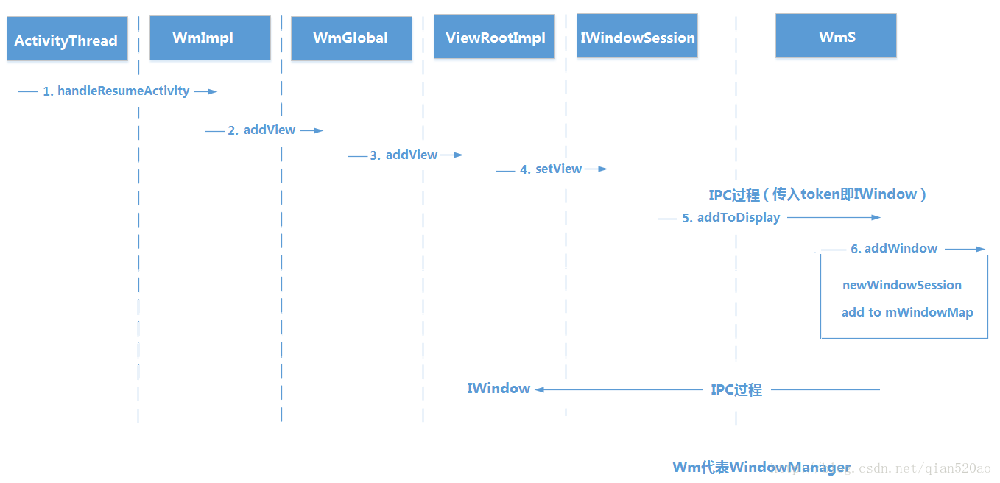

# 第八章 理解Window和WindowManager

&emsp; Window表示窗口的概念，某些情况下需要在桌面上显示一个类似悬浮窗的东西，这时需要使用Window来实现。Window是一个抽象类，具体实现是PhoneWindow。


## 8.1 Window和WindowManager
使用WindowManager添加Window的代码如下所示
```java
    mButton = new Button(this);
    mButton.setText("button");
    mLayoutParams = new WindowManager.LayoutParams(WindowManager.LayoutParams.WRAP_CONTENT, WindowManager.LayoutParams.WRAP_CONTENT, 0, 0, PixelFormat.TRANSLUCENT);
    mLayoutParams.flags = WindowManager.LayoutParams.FLAG_NOT_TOUCH_MODAL| WindowManager.LayoutParams.FLAG_NOT_FOCUSABLE| WindowManager.LayoutParams.FLAG_SHOW_WHEN_LOCKED;
    mLayoutParams.gravity = Gravity.LEFT| Gravity.TOP;
    mLayoutParams.x = 100;
    mLayoutParams.y = 300;
        
    getWindowManager().addView(mButton,mLayoutParams);
```  

上面的代码可以将一个Button添加到屏幕坐标(100, 300)的位置上。WindowManager.LayoutParams中的flags和type这两个参数比较重要。 

flags参数表示Window的属性，常见的属性如下。
- FLAG_NOT_FOCUSABLE 表示window不需要获取焦点，也不需要接收输入事件，此标记同时启用FLAG_NOT_TOUCH_MODAL，最终事件会直接传递给下层具有焦点的Window
- FLAG_NOT_TOUCH_MODAL 和FLAG_NOT_FOCUSABLE同理
- FLAG_SHOW_WHEN_LOCKED表示window可以显示在锁屏的界面上

type参数表示Window的类型，**Window有三种类型，分别是应用Window、子Window和系统Window**。
- 应用类Window对应着一个Activity
- 子Window需要依赖于特定的父Window，比如Dialog
- 系统Window是需要声明权限才能创建的Window，比如Toast和系统状态栏

&emsp; Window的分层的，每个Window都有对应的z-ordered，层级大的会覆盖在层级小Window上面，在三大类Window中，应用Window的层级是1~99，子Window的层级是1000~1999，系统Window的范围是2000~9999。如果想要Window位于所有Window的最顶层，那么采用较大的层级即可。如果采用系统的层级需要申请权限。
```java
    <uses-permission android:name="android.permission.SYSTEM_ALERT_WINDOW"/>
```
WindowManager继承了ViewManager实现了其定义的方法，分别是添加View、更新View和移除View。
```java
    public void addView(View view, ViewGroup.LayoutParams params);
    public void updateViewLayout(View view, ViewGroup.LayoutParams params);
    public void removeView(View view);
```
## 8.2 Window的内部机制

&emsp; Window是一个抽象的概念，每一个Window都对应一个View和ViewRootImpl，Window和View通过ViewRootImpl来建立联系，因此Window是以View的形式存在的。

### 8.2.1 Window的添加过程
&emsp; Window的添加过程需要通过WindowManager的addView实现，WindowManager的实现类是WindowManagerImpl类，最终是调用WindowManagerGlobal的addView()方法。

### 8.2.2 Window的删除过程

见代码注释 WindowManagerGlobal.java removeView()方法
### 8.2.3 Window的更新过程

```java

    public void updateViewLayout(View view, ViewGroup.LayoutParams params) {
        ...
        final WindowManager.LayoutParams wparams = (WindowManager.LayoutParams)params;
        // 设置布局参数
        view.setLayoutParams(wparams);

        synchronized (mLock) {
            int index = findViewLocked(view, true);
            ViewRootImpl root = mRoots.get(index);
            // 移除旧的参数 添加新的参数
            mParams.remove(index);
            mParams.add(index, wparams);
            root.setLayoutParams(wparams, false);
        }
    }
```
## 8.3 Window的创建过程 

View是Android中视图的呈现形式，但是View不能单独存在，它必须附着在Window这个抽象概念上，因此有视图的地方就有Window。
### 8.3.1 Activity的Window创建过程

**1. Window的创建过程**  
&emsp; Activity的Window创建过程和Activity的启动过程有关。Activity的启动最终是由ActivityThread的performLaunchActivity()来完成启动过程。在方法内部调用Activity的attach()方法为其关联运行过程中所依赖的上下文变量。  
&emsp; 在Activity的attach()方法中，会创建Activity所属于的Window对象并为其设置回调接口。Activity实现了Window的Callback接口。

```java
    mWindow = new PhoneWindow(this, window, activityConfigCallback);
    mWindow.setWindowControllerCallback(this);
    // 设置 callback
    mWindow.setCallback(this);
    mWindow.setOnWindowDismissedCallback(this);        
    mWindow.getLayoutInflater().setPrivateFactory(this);

```
Window的Callback接口中有一些常用的方法如下
```java
   public interface Callback {

        public void onWindowFocusChanged(boolean hasFocus);

        public void onAttachedToWindow();

        public void onDetachedFromWindow();
   }
```
Activity的视图由setContentView()方法提供，其方法代码如下。
```java
    public void setContentView(@LayoutRes int layoutResID) {
        getWindow().setContentView(layoutResID);
        initWindowDecorActionBar();
    }
```
&emsp; Activity的setContentView()方法中把具体的实现交给Window处理。在PhoneWindow的setContentView()方法中布局文件被成功的添加到了DecorView的mContentParent中，但是此时DecorView还没有被WindowManager正式添加到Window中。  

**2. Window的添加过程**  
&emsp; PhoneWindow只是负责处理一些应用窗口通用的逻辑。但是真正把一个View作为窗口添加WindowManagerService的过程是由WindowManager来完成。  
&emsp; 在ActivityThread的handleResumeActivity()中会先调用Activity的onResume()方法，然后调用makeVisible()方法。这时Activity的视图才能被用户看到。  
```java
final void handleResumeActivity(IBinder token,
            boolean clearHide, boolean isForward, boolean reallyResume, int seq, String reason) {
        r = performResumeActivity(token, clearHide, reason); 
        if (r != null) { 
            if (r.window == null && !a.mFinished && willBeVisible) { 
                r.window = r.activity.getWindow(); 
                View decor = r.window.getDecorView(); 
                decor.setVisibility(View.INVISIBLE);//不可见 
                ViewManager wm = a.getWindowManager(); 
                WindowManager.LayoutParams l = r.window.getAttributes(); 
                a.mDecor = decor; 
                l.type = WindowManager.LayoutParams.TYPE_BASE_APPLICATION; 
                ... 
                if (a.mVisibleFromClient && !a.mWindowAdded) { 
                    a.mWindowAdded = true; 
                    wm.addView(decor, l);//把decor添加到窗口上
                } 
            }  
            //屏幕参数发生了改变 
            performConfigurationChanged(r.activity, r.tmpConfig); 
            WindowManager.LayoutParams l = r.window.getAttributes(); 
            if (r.activity.mVisibleFromClient) { 
                ViewManager wm = a.getWindowManager(); 
                View decor = r.window.getDecorView(); 
                wm.updateViewLayout(decor, l);//更新窗口状态 
            }
            ...                
            if (r.activity.mVisibleFromClient) { 
                //已经成功添加到窗口上了（绘制和事件接收），设置为可见 
                r.activity.makeVisible(); 
            }
            //通知ActivityManagerService，Activity完成Resumed 
            ActivityManagerNative.getDefault().activityResumed(token); 
        }  
    }
```
Activity的Window添加流程图如下  

  

### 8.3.2 Dialog的Window创建过程

### 8.3.3 Toast的Window创建过程