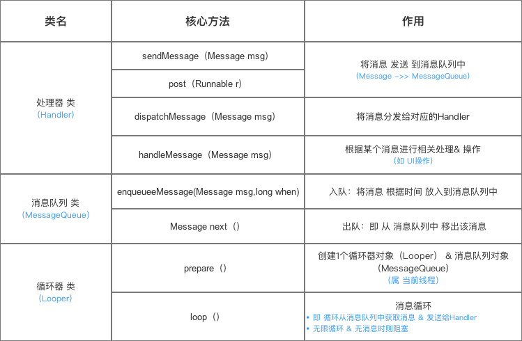
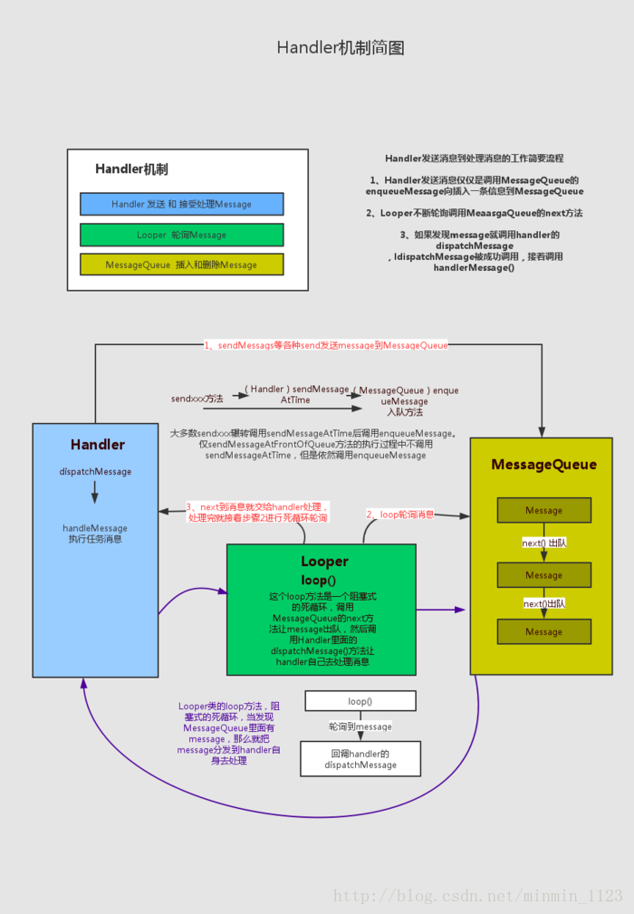

# 第十章 Android的消息机制
&emsp; 从开发的角度来说Handler是Android消息机制的上层接口，这样在开发的过程中只需和Handler交互即可，Handler常用来更新UI，也可以用来在子线程执行一些耗时操作的I/O操作，或者是读取文件或者访问网络。  
Android的消息机制是指Handler的运行机制，Handler的运行需要底层的MessageQueue和Looper的支撑。  

- MessageQueue的中文翻译是消息队列，内部存储了一组消息，以队列的形式对外提供插入和删除的工作。内部结构是采用单链表的数据结构来存储消息列表。
- Looper翻译为消息循环，作用是不断的从消息队列中循环读取消息并且分发给目标处理者。
  
## 10.1 Android的消息机制概述
&emsp; Android的消息机制是指Handler的运行机制，是Handler、MessageQueue和Looper三者配合完成的。Handler的主要作用是将一个任务切换到某个指定的线程中去执行。Android中规定只能在主线程也就是UI线程中去访问UI，因此需要执行一些耗时操作时需要切换到子线程执行然后通过Handler在主线程更新UI。  

Q: Android不允许在非主线程更新UI的原因?  
A: Android中的UI控件不是线程安全的，在多线程中访问UI会导致UI处于不可预期的状态。  

&emsp; Handler创建时默认采用当前线程的Looper来构建内部的消息循环系统。如果当前线程没有Looper就会报错。
```java
    public Handler(Callback callback, boolean async) {
        // 省略代码
        mLooper = Looper.myLooper();
        if (mLooper == null) {
            throw new RuntimeException(
                "Can't create handler inside thread that has not called Looper.prepare()");
        }
    }
```
&emsp; Handler创建完毕后，内部的Looper和MessageQueue就可以和Handler协同工作了，通过Handler的sendMessage()和post()方法最终将会通过MessageQueue的enqueueMessage()方法入队列，Looper发现有消息时就会处理这个消息，最终消息中的Runnable或者Handler的handlerMessage()就会被调用。Looper是运行在创建Handler中的线程中的，所以Handler中的业务逻辑就会被切换到创建Handler所在的线程中去执行了。  

**Handler机制相关类的重要方法如下**

  

## 10.2 Android的消息机制分析
### 10.2.1 ThreadLocal的工作原理
&emsp; Threadlocal而是一个线程内部的存储类，可以在指定线程内存储数据，数据存储以后，只有指定线程可以得到存储数据。官方文档的解释如下。
>   This class provides thread-local variables. These variables differ from
  their normal counterparts in that each thread that accesses one (via its
  {@code get} or {@code set} method) has its own, independently initialized
  copy of the variable.  {@code ThreadLocal} instances are typically private
  static fields in classes that wish to associate state with a thread (e.g.,
  a user ID or Transaction ID).

&emsp; Thread中的静态内部类ThreadLocalMap为每个Thread都维护了一个数组table，ThreadLocal确定了一个数组的下标，而这个下标就是value存储相应 的位置。ThreadLocal中的相关方法如下。
```java
    public T get() {
        Thread t = Thread.currentThread();
        ThreadLocalMap map = getMap(t);
        if (map != null) {
            ThreadLocalMap.Entry e = map.getEntry(this);
            if (e != null) {
                @SuppressWarnings("unchecked")
                T result = (T)e.value;
                return result;
            }
        }
        return setInitialValue();
    }

    public void set(T value) {
        Thread t = Thread.currentThread();
        ThreadLocalMap map = getMap(t);
        if (map != null)
            map.set(this, value);
        else
            createMap(t, value);
    }

    ThreadLocalMap getMap(Thread t) {
        return t.threadLocals;
    }

    void createMap(Thread t, T firstValue) {
        t.threadLocals = new ThreadLocalMap(this, firstValue);
    }

```
每个线程，都有持有一个ThreadLocalMap对象。
```java
    /* ThreadLocal values pertaining to this thread. This map is maintained
     * by the ThreadLocal class. */
    ThreadLocal.ThreadLocalMap threadLocals = null;
```
**ThreadLocal特性**   
&emsp; ThreadLocal和Synchronized都是为了解决多线程中相同变量的访问冲突问题，不同的点是

- Synchronized是通过线程等待，牺牲时间来解决访问冲突
- ThreadLocal是通过每个线程单独一份存储空间，牺牲空间来解决冲突，并且相比于Synchronized，ThreadLocal具有线程隔离的效果，只有在线程内才能获取到对应的值，线程外则不能访问到想要的值。  
[ThreadLocal文章链接]("https://www.jianshu.com/p/3c5d7f09dfbd")
### 10.2.2 消息队列的工作原理
&emsp; 消息队列在Android中指的是MessageQueue，MessageQueue主要包含两个操作，插入和读取。读取操作会伴随着删除操作。插入和读取分别对应着MessageQueue中的enqueueMessage()和next()。enqueueMessage的作用是往消息队列中插入一条消息。next的作用是从消息队列中取出一条消息并将其从消息队列中移除。MessageQueue内部的实现是采用链表的数据结构来维护消息列表。

### 10.2.3 Looper的工作原理
&emsp; Looper在消息机制中是负责消息循环。它会不断的从MessageQueue中查看是否有新消息，如果有新消息就会立刻处理，否则就一直阻塞在那里。Looper的构造方法中会创建一个MessageQueue即消息队列，然后将当前线程的对象保存起来。
``` java
    private Looper(boolean quitAllowed) {
        mQueue = new MessageQueue(quitAllowed);
        mThread = Thread.currentThread();
    }
```
Looper中有一个重要的方法loop()，只有调用了loop方法，消息循环才会开始进行。
### 10.2.4 Handler的工作原理
&emsp; Handler的工作包括包含消息的发送和接收过程。消息的发送可以通过post的一系列方法或者sendMessage的系列方法来实现。
``` java
    public final boolean sendMessage(Message msg){
        return sendMessageDelayed(msg, 0);
    }
    public final boolean sendMessageDelayed(Message msg, long delayMillis){
        if (delayMillis < 0) {
            delayMillis = 0;
        }
        return sendMessageAtTime(msg, SystemClock.uptimeMillis() + delayMillis);
    }

    public boolean sendMessageAtTime(Message msg, long uptimeMillis) {
        MessageQueue queue = mQueue;
        if (queue == null) {
            RuntimeException e = new RuntimeException(
                    this + " sendMessageAtTime() called with no mQueue");
            Log.w("Looper", e.getMessage(), e);
            return false;
        }
        return enqueueMessage(queue, msg, uptimeMillis);
    }
    private boolean enqueueMessage(MessageQueue queue, Message msg, long uptimeMillis) {
        msg.target = this;
        if (mAsynchronous) {
            msg.setAsynchronous(true);
        }
        // 最终调用MessageQueue的enqueueMessage()
        return queue.enqueueMessage(msg, uptimeMillis);
    }
```
&emsp; Handler发送消息的过程是向MessageQueue中插入了一条消息，MessageQueue的next方法就会返回这条消息给Looper，Looper收到消息后就会交给Handler来处理，即调用Handler的dispatchMessage方法。
```java
    /**
     * Handle system messages here.
     */
    public void dispatchMessage(Message msg) {
        if (msg.callback != null) {
            // Runnable中的run()方法执行，也就是post方法执行的对象
            handleCallback(msg);
        } else {
            if (mCallback != null) {
                // callback中的回调
                if (mCallback.handleMessage(msg)) {
                    return;
                }
            }
            // 子类的方法回调
            handleMessage(msg);
        }
    }
```
## 10.3 主线程的消息循环
&emsp; Android的主线程是ActivityThread，主线程入口的方法是main，Looper中提供了prepareMainLooper方法来开启主线程的消息循环。
```java
    public static void main(String[] args) {
        // 省略代码
        Process.setArgV0("<pre-initialized>");

        Looper.prepareMainLooper();

        ActivityThread thread = new ActivityThread();
        thread.attach(false);

        if (sMainThreadHandler == null) {
            sMainThreadHandler = thread.getHandler();
        }

        if (false) {
            Looper.myLooper().setMessageLogging(new
                    LogPrinter(Log.DEBUG, "ActivityThread"));
        }

        // End of event ActivityThreadMain.
        Trace.traceEnd(Trace.TRACE_TAG_ACTIVITY_MANAGER);
        Looper.loop();

        throw new RuntimeException("Main thread loop unexpectedly exited");
    }
```

