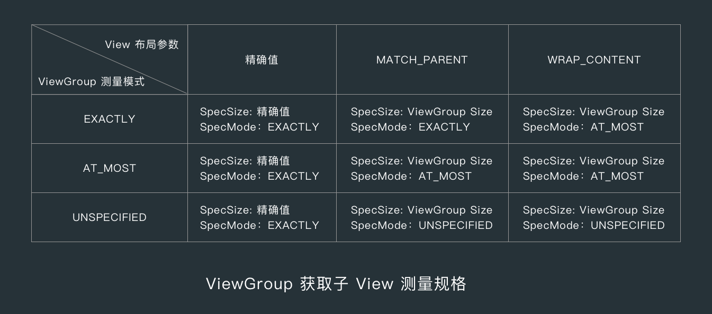
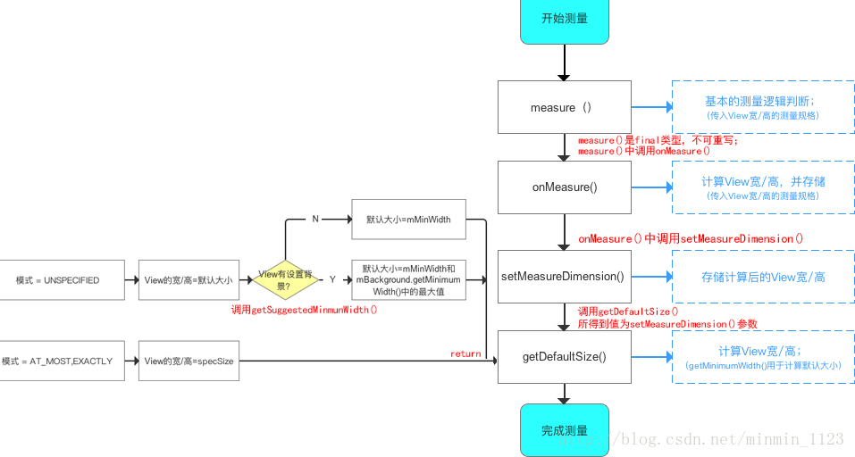
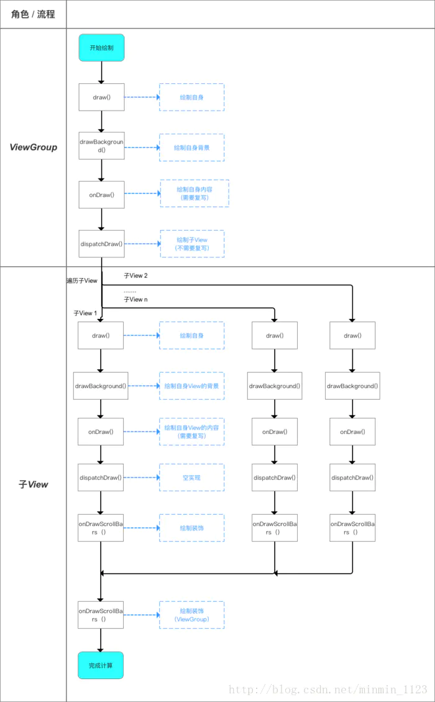

# **View的工作原理**

## 初识ViewRoot和DecorView
&ensp;&ensp;ViewRoot对应于的是ViewRootImpl类，它是连接WindowManager和DecorView的纽带。在ActivityThread中当Activity对象被创建完毕后，会将DecorView添加到Window中，同时创建ViewRootImpl对象，并且将ViewRootImpl对象和DecorView建立关联(参见WindowManagerGlobal类345行)。
``` java
/**
 * ViewRootImpl
 * The top of a view hierarchy, implementing the needed protocol between View
 * and the WindowManager.  This is for the most part an internal implementation
 * detail of {@link WindowManagerGlobal}.
 *
 */
```

&ensp;&ensp;View的绘制流程是从ViewRootImpl的performTraversals方法开始的，其中measure用来测量View的宽和高，layout用来确定View的位置，draw用来负责将View绘制在屏幕上。

&ensp;&ensp;DecorView作为顶级的View，一般情况下它内部会包含一个竖直方向的LinearLayout，在这个LinearLayout中有上下两部分，上面是标题栏下面是内容栏。在Activity中的onCreate()方法中通过setContentView()方法设置的layout的id就是设置内容栏的布局。  


## 理解MeasureSpec

&ensp;&ensp;MeaureSpec代表一个32位的int值，高2位代表的是SpecMode，低30位代表的是SpecSize，SpecMode代表的是测量模式，SpecSize代表的是某种测量模式下的规格大小。SpecMode有三类在下面代码注释中有说明。
```java
        private static final int MODE_SHIFT = 30;
        //运算遮罩 0x3十六进制 对应二进制 11 
        //左移30位 11 0000 0000 0000 0000 0000 0000 0000 00
        //用1来标注需要的值 0来标注不需要的值 因1与任何数做与运算都得任何数、0与任何数做与运算都得0
        private static final int MODE_MASK  = 0x3 << MODE_SHIFT;

        /**
         * Measure specification mode: The parent has not imposed any constraint
         * on the child. It can be whatever size it wants.
           00 0000 0000 0000 0000 0000 0000 0000 00
         */
        public static final int UNSPECIFIED = 0 << MODE_SHIFT;

        /**
         * Measure specification mode: The parent has determined an exact size
         * for the child. The child is going to be given those bounds regardless
         * of how big it wants to be.
         * 对应于LayoutParams中的match_parent和具体的数值
         * 01 0000 0000 0000 0000 0000 0000 0000 00
         */
        public static final int EXACTLY     = 1 << MODE_SHIFT;

        /**
         * Measure specification mode: The child can be as large as it wants up
         * to the specified size. 
         * 对应于LayoutParams中的wrap_content
         * 10 0000 0000 0000 0000 0000 0000 0000 00
         */
        public static final int AT_MOST     = 2 << MODE_SHIFT;

        //获取测量模式
        //保留measureSpec的高两位 (measureSpec & 11 00...000) 11后面30个0
        public static int getMode(int measureSpec) {
            return (measureSpec & MODE_MASK);
        }
        //获取测量尺寸
        //保留measureSpec的低30位(measureSpec & 00 11...111) 00后面30个1
        public static int getSize(int measureSpec) {
            return (measureSpec & ~MODE_MASK);
        }
```

&ensp;&ensp;在View进行测量的时候，系统会将LayoutParams在父容器的约束下转换成对应的MeasureSpec，然后再根据这个MeasureSpec来确定View测量后的宽/高。MeasureSpec不是唯一由LayoutParams决定的，LayoutParams需要和父容器一起才决定View的MeasureSpec，从而决定View的宽/高。
- 对于顶级View(DecorView)，其MeasureSpec由窗口的尺寸和其自身的LayoutParams来共同确定
- 对于普通View，其MeasureSpec由父容器的MeasureSpec和其自身的LayoutParams来确定

对于顶级View的情况: ViewRootImpl中的measureHierarchy()方法中显示了DecorView的MeasureSpec的创建过程。
```java
    childWidthMeasureSpec = getRootMeasureSpec(baseSize, lp.width);
    childHeightMeasureSpec = getRootMeasureSpec(desiredWindowHeight, lp.height);
    performMeasure(childWidthMeasureSpec, childHeightMeasureSpec);
```
getRootMeasureSpec()方法实现如下
```java
private static int getRootMeasureSpec(int windowSize, int rootDimension) {
        int measureSpec;
        switch (rootDimension) {

        case ViewGroup.LayoutParams.MATCH_PARENT:
            // Window can't resize. Force root view to be windowSize.
            measureSpec = MeasureSpec.makeMeasureSpec(windowSize, MeasureSpec.EXACTLY);
            break;
        case ViewGroup.LayoutParams.WRAP_CONTENT:
            // Window can resize. Set max size for root view.
            measureSpec = MeasureSpec.makeMeasureSpec(windowSize, MeasureSpec.AT_MOST);
            break;
        default:
            // Window wants to be an exact size. Force root view to be that size.
            measureSpec = MeasureSpec.makeMeasureSpec(rootDimension, MeasureSpec.EXACTLY);
            break;
        }
        return measureSpec;
    }
```

对于普通的View的来说，View的measure过程由ViewGroup传递过来，
``` java
 /**
     * Ask one of the children of this view to measure itself, taking into
     * account both the MeasureSpec requirements for this view and its padding
     * and margins. The child must have MarginLayoutParams The heavy lifting is
     * done in getChildMeasureSpec.
     *
     */
    protected void measureChildWithMargins(View child,
            int parentWidthMeasureSpec, int widthUsed,
            int parentHeightMeasureSpec, int heightUsed) {
        final MarginLayoutParams lp = (MarginLayoutParams) child.getLayoutParams();

        final int childWidthMeasureSpec = getChildMeasureSpec(parentWidthMeasureSpec,
                mPaddingLeft + mPaddingRight + lp.leftMargin + lp.rightMargin
                        + widthUsed, lp.width);
        final int childHeightMeasureSpec = getChildMeasureSpec(parentHeightMeasureSpec,
                mPaddingTop + mPaddingBottom + lp.topMargin + lp.bottomMargin
                        + heightUsed, lp.height);

        child.measure(childWidthMeasureSpec, childHeightMeasureSpec);
    }

```

**从代码可以看出来子View的MeasureSpec的创建与父容器的MeasureSpec和其自身的LayoutParams有关**。此外还与View的margin及padding有关。

```java 
 public static int getChildMeasureSpec(int spec, int padding, int childDimension) {
        //传递进来的父容器的测量模式和尺寸
        int specMode = MeasureSpec.getMode(spec);
        int specSize = MeasureSpec.getSize(spec);
        //父容器最大可用尺寸 容器尺寸 - padding
        int size = Math.max(0, specSize - padding);
        //算出的子View的尺寸和模式
        int resultSize = 0;
        int resultMode = 0;
        //判断父容器的测量模式
        switch (specMode) {
        // Parent has imposed an exact size on us 父容器指定了具体的尺寸
        case MeasureSpec.EXACTLY:
            //子View有具体的值
            if (childDimension >= 0) {
                resultSize = childDimension;
                resultMode = MeasureSpec.EXACTLY;
            } else if (childDimension == LayoutParams.MATCH_PARENT) {
                // Child wants to be our size. So be it.
                resultSize = size;
                resultMode = MeasureSpec.EXACTLY;
            } else if (childDimension == LayoutParams.WRAP_CONTENT) {
                // Child wants to determine its own size. It can't be
                // bigger than us.
                resultSize = size;
                resultMode = MeasureSpec.AT_MOST;
            }
            break;

        // Parent has imposed a maximum size on us 父容器指定了一个最大尺寸
        case MeasureSpec.AT_MOST:
            if (childDimension >= 0) {
                // Child wants a specific size... so be it
                resultSize = childDimension;
                resultMode = MeasureSpec.EXACTLY;
            } else if (childDimension == LayoutParams.MATCH_PARENT) {
                // Child wants to be our size, but our size is not fixed.
                // Constrain child to not be bigger than us.
                resultSize = size;
                resultMode = MeasureSpec.AT_MOST;
            } else if (childDimension == LayoutParams.WRAP_CONTENT) {
                // Child wants to determine its own size. It can't be
                // bigger than us.
                resultSize = size;
                resultMode = MeasureSpec.AT_MOST;
            }
            break;

        // Parent asked to see how big we want to be
        case MeasureSpec.UNSPECIFIED:
            if (childDimension >= 0) {
                // Child wants a specific size... let him have it
                resultSize = childDimension;
                resultMode = MeasureSpec.EXACTLY;
            } else if (childDimension == LayoutParams.MATCH_PARENT) {
                // Child wants to be our size... find out how big it should
                // be
                resultSize = View.sUseZeroUnspecifiedMeasureSpec ? 0 : size;
                resultMode = MeasureSpec.UNSPECIFIED;
            } else if (childDimension == LayoutParams.WRAP_CONTENT) {
                // Child wants to determine its own size.... find out how
                // big it should be
                resultSize = View.sUseZeroUnspecifiedMeasureSpec ? 0 : size;
                resultMode = MeasureSpec.UNSPECIFIED;
            }
            break;
        }
        return MeasureSpec.makeMeasureSpec(resultSize, resultMode);
    }

```

## View的工作流程

View的工作流程主要是指measure、layout、draw这三大流程，即测量、布局和绘制，其中measure主要确定View的宽和高，layout确定View的最终宽/高和四个顶点的位置，而draw会将View绘制到屏幕上。

### **measure过程**
- View的measure过程
  


View的measure过程会去调用onMeasure()方法，onMeasure方法实现如下
```java
 /**
     * <p>
     * Measure the view and its content to determine the measured width and the
     * measured height. This method is invoked by {@link #measure(int, int)} and
     * should be overridden by subclasses to provide accurate and efficient
     * measurement of their contents.
     * </p>
     * <p>
     * 这个方法由measure(int, int)调用，并且应该被子类覆盖，以提供对其内容的准确和有效的度量。
     * </p>
     * <p>
     *  When overriding this method, you must call        
     * {@link#setMeasuredDimension(int, int)} to store the
     * measured width and height of this view. Failure to do so will trigger an
     * <code>IllegalStateException</code>, thrown by
     * {@link #measure(int, int)}. Calling the superclass'
     * {@link #onMeasure(int, int)} is a valid use.
     * </p>
     *
     * <p>
     * The base class implementation of measure defaults to the background size,
     * unless a larger size is allowed by the MeasureSpec. Subclasses should
     * override {@link #onMeasure(int, int)} to provide better measurements of
     * their content.
     * </p>
     *
     * <p>
     * If this method is overridden, it is the subclass's responsibility to make
     * sure the measured height and width are at least the view's minimum height
     * and width ({@link #getSuggestedMinimumHeight()} and
     * {@link #getSuggestedMinimumWidth()}).
     * </p>
     */
    protected void onMeasure(int widthMeasureSpec, int heightMeasureSpec) {
        setMeasuredDimension(getDefaultSize(getSuggestedMinimumWidth(), widthMeasureSpec),
                getDefaultSize(getSuggestedMinimumHeight(), heightMeasureSpec));
    }

```
setMeasuredDimension方法会设置测量好的View的宽/高的值。
```java
public static int getDefaultSize(int size, int measureSpec) {
        int result = size;
        int specMode = MeasureSpec.getMode(measureSpec);
        int specSize = MeasureSpec.getSize(measureSpec);

        switch (specMode) {
        case MeasureSpec.UNSPECIFIED:
            result = size;
            break;
        case MeasureSpec.AT_MOST:
        case MeasureSpec.EXACTLY:
            result = specSize;
            break;
        }
        return result;
    }
```
从getDefaultSize()方法来看，不去考虑UNSPECIFIED情况，这种情况一般出现在系统内部的测量过程，那么View的宽/高由specSize决定，由此可以得出结论:直接继承自View的自定义控件需要重写onMeasure()方法并且设置wrap_content时的自身大小，否则在布局中使用wrap_content和使用match_parent的效果一样([链接文章](https://www.jianshu.com/p/ca118d704b5e))，解决此问题的代码如下。
```java
@Override
    protected void onMeasure(int widthMeasureSpec, int heightMeasureSpec) {
        super.onMeasure(widthMeasureSpec,heightMeasureSpec);
        
        int widthSpecMode = MeasureSpec.getMode(widthMeasureSpec);
        int widthSpecSize = MeasureSpec.getSize(widthMeasureSpec);
        int heightSpecMode = MeasureSpec.getMode(heightMeasureSpec);
        int heightSpecSize = MeasureSpec.getSize(heightMeasureSpec);
        //分析模式，根据不同的模式来设置
        //当模式时wrap_content时 设置默认值 特殊情况:当父View是AT_MOST模式子View是match_parent模式时，该View的match_parent和wrap_content效果相同 

        if(widthSpecMode == MeasureSpec.AT_MOST && heightSpecMode == MeasureSpec.AT_MOST){
            setMeasuredDimension(mWidth, mHeight);
        }else if(widthSpecMode == MeasureSpec.AT_MOST){
            setMeasuredDimension(mWidth, heightSpecSize);
        }else if(heightSpecMode == MeasureSpec.AT_MOST){
            setMeasuredDimension(widthSpecSize, mHeight);
        }

        //另外一种解决方案
        // 当布局参数设置为wrap_content时，设置默认值
        if (getLayoutParams().width == ViewGroup.LayoutParams.WRAP_CONTENT 
                && getLayoutParams().height == ViewGroup.LayoutParams.WRAP_CONTENT) {
            setMeasuredDimension(mWidth, mHeight);
            // 宽/高任意一个布局参数为= wrap_content时，都设置默认值
        } else if (getLayoutParams().width == ViewGroup.LayoutParams.WRAP_CONTENT) {
            setMeasuredDimension(mWidth, heightSize);
        } else if (getLayoutParams().height == ViewGroup.LayoutParams.WRAP_CONTENT) {
            setMeasuredDimension(widthSize, mHeight);
        }
    }
```
- ViewGroup的measure过程  
  ViewGroup除了完成自己的measure过程以外，还会去遍历调用所有子元素的measure方法，各个子元素再去递归的执行这个过程，与View不同的是ViewGroup是一个抽象类，因此它没有重写View的onMeasure方法，但是提供了一个measureChildren()方法

    

  ViewGroup没有定义其测量的具体过程，那是因为ViewGroup是一个抽象类，其测量过程的onMeasure方法需要各自子类去实现。
  当measure完成后，就可以通过view.getMeasuredWidth/Height方法就可以正确的获取到View的宽和高。自定义ViewGroup实现onMeasure()方法的思路如下
  ```java
    /**
    * 根据自身的测量逻辑复写onMeasure()，分为3步
    *   1. 遍历所有子View & 测量：measureChildren()
    *   2. 合并所有子View的尺寸大小，最终得到ViewGroup父视图的测量值(自身实现)
    *   3. 存储测量后View宽/高的值：调用setMeasuredDimension()  
    **/ 

  @Override
  protected void onMeasure(int widthMeasureSpec, int heightMeasureSpec) {  

        // 定义存放测量后的View宽/高的变量
        int widthMeasure ;
        int heightMeasure ;

        // 1. 遍历所有子View & 测量(measureChildren())
        // ->> 分析1
        measureChildren(widthMeasureSpec, heightMeasureSpec)；

        // 2. 合并所有子View的尺寸大小，最终得到ViewGroup父视图的测量值
         void measureCarson{
             ... // 自身实现
         }

        // 3. 存储测量后View宽/高的值：调用setMeasuredDimension()  
        // 类似单一View的过程，此处不作过多描述
        setMeasuredDimension(widthMeasure,  heightMeasure);  
  }
  // 从上可看出：
  // 复写onMeasure()有三步，其中2步直接调用系统方法
  // 需自身实现的功能实际仅为步骤2：合并所有子View的尺寸大小

    /**
    * 分析1：measureChildren()
    * 作用：遍历子View & 调用measureChild()进行下一步测量
    **/ 

    protected void measureChildren(int widthMeasureSpec, int heightMeasureSpec) {
        // 参数说明：父视图的测量规格（MeasureSpec）

                final int size = mChildrenCount;
                final View[] children = mChildren;

                // 遍历所有子view
                for (int i = 0; i < size; ++i) {
                    final View child = children[i];
                     // 调用measureChild()进行下一步的测量 ->>分析1
                    if ((child.mViewFlags & VISIBILITY_MASK) != GONE) {
                        measureChild(child, widthMeasureSpec, heightMeasureSpec);
                    }
                }
            }

    /**
    * 分析2：measureChild()
    * 作用：a. 计算单个子View的MeasureSpec
    *      b. 测量每个子View最后的宽 / 高：调用子View的measure()
    **/ 
  protected void measureChild(View child, int parentWidthMeasureSpec,
            int parentHeightMeasureSpec) {

        // 1. 获取子视图的布局参数
        final LayoutParams lp = child.getLayoutParams();

        // 2. 根据父视图的MeasureSpec & 布局参数LayoutParams，计算单个子View的MeasureSpec
        // getChildMeasureSpec() 请看上面代码
        // 获取 ChildView 的 widthMeasureSpec
        final int childWidthMeasureSpec = getChildMeasureSpec(parentWidthMeasureSpec,
                mPaddingLeft + mPaddingRight, lp.width);
        // 获取 ChildView 的 heightMeasureSpec
        final int childHeightMeasureSpec = getChildMeasureSpec(parentHeightMeasureSpec,
                mPaddingTop + mPaddingBottom, lp.height);

        // 3. 将计算好的子View的MeasureSpec值传入measure()，进行最后的测量
        // 下面的流程即类似单一View的过程，此处不作过多描述
        child.measure(childWidthMeasureSpec, childHeightMeasureSpec);
    }
    // 回到调用原处

  ```


  **如何在Activity中获取view的宽度和高度 ?**  
  Activity的生命周期和view的measure过程并没有同步，因为无法在Activity的生命周期回调中获取view的宽度和高度。  
  1. Activity/View#onWindowFocusChanged
    onWindowFocusChanged()回调发生时View已经初始化完毕了，可以再此方法中获取View的宽度和高度，需要注意的是此方法可能会被调用多次。
  2. view.post(runnable)
    通过post方法可以将一个runnable投递到消息队列的尾部，然后等到Looper调用此runnable的时候，View已经初始化完毕了。
    ```java
    protected void onStart(){
        super.onStart();
        view.post(new Runnable(){

            @Override
            public void run(){
                int width = view.getMeasuredWidth();
                int height = view.getMeasuredHeight();
            }
        });
    }
    ```
    1. ViewTreeObserver  
        使用ViewTreeObserver的众多接口回调可以完成这个功能，比如使用OnGlobalLayoutListener这个接口。
    2. view.measure(int widthMeasureSpec, int heightMeasureSpec)  
    手动对View进行measure来得到View的宽/高     

### **layout过程**
layout过程的作用是确定View的四个顶点的位置top、left、right和bottom。

  

View的绘制流程是从ViewRootImpl的performTraversals方法开始的，在此方法中会依次调用performMeasure()、performLayout()、performDraw()。
``` java
private void performLayout(WindowManager.LayoutParams lp, int desiredWindowWidth,
        int desiredWindowHeight) {
    mLayoutRequested = false;
    mScrollMayChange = true;
    mInLayout = true;

    final View host = mView;
    if (DEBUG_ORIENTATION || DEBUG_LAYOUT) {
        Log.v(TAG, "Laying out " + host + " to (" +
                host.getMeasuredWidth() + ", " + host.getMeasuredHeight() + ")");
    }

    Trace.traceBegin(Trace.TRACE_TAG_VIEW, "layout");
    try {
        //调用View的layout方法
        host.layout(0, 0, host.getMeasuredWidth(), host.getMeasuredHeight()); // 1

        //省略...
    } finally {
        Trace.traceEnd(Trace.TRACE_TAG_VIEW);
    }
    mInLayout = false;
}

```
从上面代码可以看出在调用DecorView的layout方法时传递的参数分别是上下左右四个位置的坐标。接下来是View#layout方法

```java 
public void layout(int l, int t, int r, int b) {
        if ((mPrivateFlags3 & PFLAG3_MEASURE_NEEDED_BEFORE_LAYOUT) != 0) {
            onMeasure(mOldWidthMeasureSpec, mOldHeightMeasureSpec);
            mPrivateFlags3 &= ~PFLAG3_MEASURE_NEEDED_BEFORE_LAYOUT;
        }

        int oldL = mLeft;
        int oldT = mTop;
        int oldB = mBottom;
        int oldR = mRight;
        //调用setFrame方法
        boolean changed = isLayoutModeOptical(mParent) ?
                setOpticalFrame(l, t, r, b) : setFrame(l, t, r, b);

        if (changed || (mPrivateFlags & PFLAG_LAYOUT_REQUIRED) == PFLAG_LAYOUT_REQUIRED) {
            //调用onLayout方法
            onLayout(changed, l, t, r, b);
            mPrivateFlags &= ~PFLAG_LAYOUT_REQUIRED;

            ListenerInfo li = mListenerInfo;
            if (li != null && li.mOnLayoutChangeListeners != null) {
                ArrayList<OnLayoutChangeListener> listenersCopy =
                        (ArrayList<OnLayoutChangeListener>)li.mOnLayoutChangeListeners.clone();
                int numListeners = listenersCopy.size();
                for (int i = 0; i < numListeners; ++i) {
                    listenersCopy.get(i).onLayoutChange(this, l, t, r, b, oldL, oldT, oldR, oldB);
                }
            }
        }

        mPrivateFlags &= ~PFLAG_FORCE_LAYOUT;
        mPrivateFlags3 |= PFLAG3_IS_LAID_OUT;
    }
```
调用setFrame()方法来设定View的四个顶点的位置，View的四个顶点的位置一旦确定，那么View在父容器中的位置也确定了，接着调用onLayout方法用来在父容器中确定子元素的位置。View的onLayout方法是空实现。ViewGroup中的onLayout()方法为抽象方法，需要交由继承自ViewGroup的类去实现。FrameLayout中的实现如下
```java
@Override
    protected void onLayout(boolean changed, int left, int top, int right, int bottom) {
        layoutChildren(left, top, right, bottom, false /* no force left gravity */);
    }

    void layoutChildren(int left, int top, int right, int bottom, boolean forceLeftGravity) {
        final int count = getChildCount();
        //影响子View的布局参数
        final int parentLeft = getPaddingLeftWithForeground();
        final int parentRight = right - left - getPaddingRightWithForeground();

        final int parentTop = getPaddingTopWithForeground();
        final int parentBottom = bottom - top - getPaddingBottomWithForeground();
        //循环遍历子View
        for (int i = 0; i < count; i++) {
            final View child = getChildAt(i);
            //不为GONE类型的
            if (child.getVisibility() != GONE) {
                //子View的布局参数
                final LayoutParams lp = (LayoutParams) child.getLayoutParams();
                //当前子View的宽和高
                final int width = child.getMeasuredWidth();
                final int height = child.getMeasuredHeight();
                //算出最终的子View的left和top
                int childLeft;
                int childTop;

                int gravity = lp.gravity;
                if (gravity == -1) {
                    gravity = DEFAULT_CHILD_GRAVITY;
                }

                final int layoutDirection = getLayoutDirection();
                final int absoluteGravity = Gravity.getAbsoluteGravity(gravity, layoutDirection);
                final int verticalGravity = gravity & Gravity.VERTICAL_GRAVITY_MASK;
                //水平方向的layout_gravity参数
                switch (absoluteGravity & Gravity.HORIZONTAL_GRAVITY_MASK) {
                    /* 水平居中，由于子View要在水平中间的位置显示，因此，要先计算出以下：
                    * (parentRight - parentLeft -width)/2 此时得出的是父容器减去子View宽度后的
                    * 剩余空间的一半，那么再加上parentLeft后，就是子View初始左上角横坐标(此时正好位于中间位置)，
                    * 假如子View还受到margin约束，由于leftMargin使子View右偏而rightMargin使子View左偏，所以最后
                    * 是 +leftMargin - rightMargin .
                    */
                    case Gravity.CENTER_HORIZONTAL:
                        childLeft = parentLeft + (parentRight - parentLeft - width) / 2 +
                        lp.leftMargin - lp.rightMargin;
                        break;
                    //水平居右 父容器Right-子View宽度 - 子View右Margin    
                    case Gravity.RIGHT:
                        if (!forceLeftGravity) {
                            childLeft = parentRight - width - lp.rightMargin;
                            break;
                        }
                    //不设置layout_gravity时默认就是靠左 子View的左Margin+父容器的左Margin    
                    case Gravity.LEFT:
                    default:
                        childLeft = parentLeft + lp.leftMargin;
                }

                switch (verticalGravity) {
                    case Gravity.TOP:
                        childTop = parentTop + lp.topMargin;
                        break;
                    case Gravity.CENTER_VERTICAL:
                        childTop = parentTop + (parentBottom - parentTop - height) / 2 +
                        lp.topMargin - lp.bottomMargin;
                        break;
                    case Gravity.BOTTOM:
                        childTop = parentBottom - height - lp.bottomMargin;
                        break;
                    default:
                        childTop = parentTop + lp.topMargin;
                }
                //调用子View自己的layout方法
                child.layout(childLeft, childTop, childLeft + width, childTop + height);
            }
        }
    }
```

### **draw过程**

1. Draw the background(绘制背景)
2. If necessary, save the canvas' layers to prepare for fading
3. Draw view's content(绘制自己   重写onDraw()方法)
4. Draw children(绘制子节点 dispatchDraw())
5. If necessary, draw the fading edges and restore layers
6. Draw decorations (scrollbars for instance)(绘制装饰)





## 自定义View  


自定义View的分类
- 继承View重写onDraw()方法，采用这种方式需要自己支持wrap_content并且padding也需要自己处理
- 继承ViewGroup派生特殊的Layout
- 继承特殊的View(TextView、ImageView)
- 继承特殊的ViewGroup(LinearLayout)

自定义View须知

1. 让自定义View支持wrap_content，如果继承自View或者ViewGroup的控件，如果不在onMeasure()方法中对于wrap_content做处理则当view设置为wrap_content时效果和match_parent是一样的。
2. 如果有必要让自定义View支持padding，如果直接继承自View的控件如果不在draw()方法中处理padding，那么padding属性是无法起作用的。
3. 尽量不要在View中使用Handler，View本身提供了post系列的方法可以代替Handler的作用。
4. View中如果有线程在运行或者动画在执行，在View#onDetachedFromWindow方法中及时停止，否则可能导致内存泄漏。
5. View可以滑动嵌套情形时，需要处理好滑动冲突。


     


